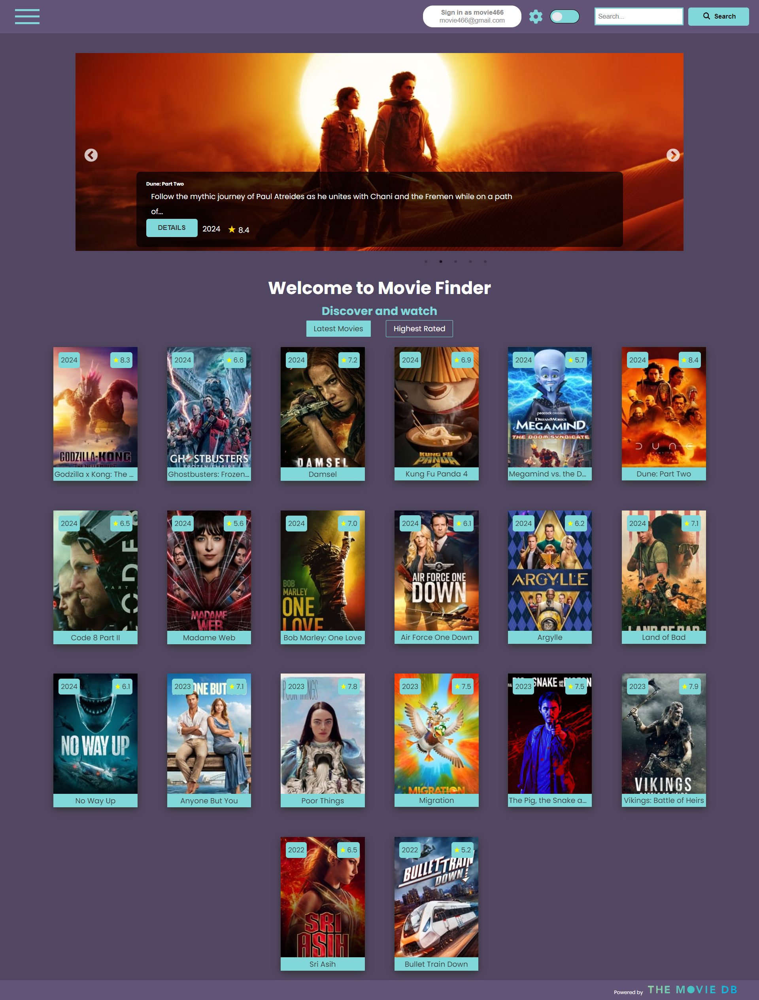
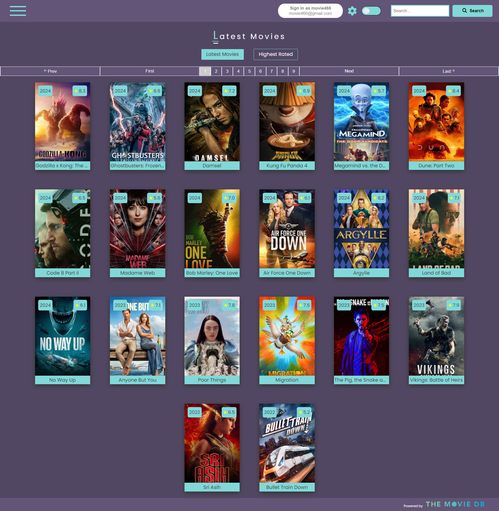
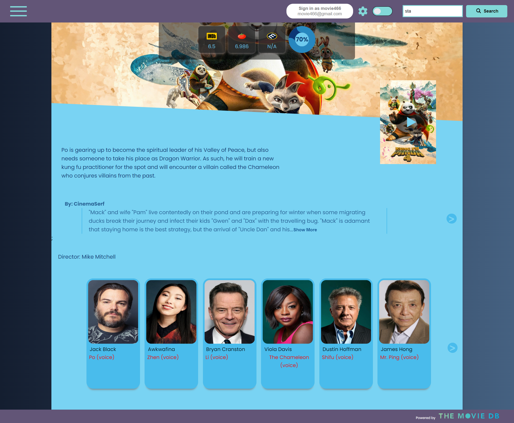
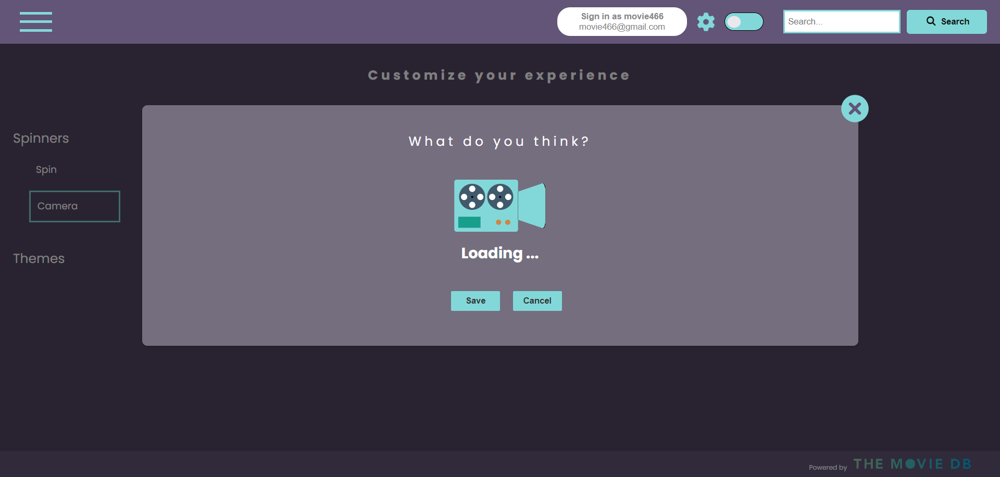
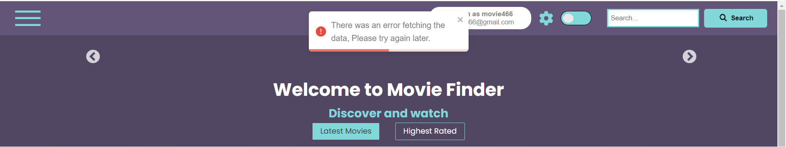

# Movies App

## Table of Contents

- [Movies App](#movies-app)
  - [Table of Contents](#table-of-contents)
  - [Acknowledgments](#acknowledgments)
  - [Overview](#overview)
  - [Live Demo](#live-demo)
  - [Features](#features)
  - [Tech Stack](#tech-stack)
  - [Screenshots](#screenshots)
    - [Home Screen](#home-screen)
    - [Movies Screen](#movies-screen)
    - [Movie Details Screen](#movie-details-screen)
    - [Advanced Search Screen](#advanced-search-screen)
    - [Spinners and Themes Page](#spinners-and-themes-page)
    - [Error Toast](#error-toast)
  - [Getting Started](#getting-started)
  - [API Integration](#api-integration)
    - [Environment Variable Protection](#environment-variable-protection)
  - [Custom Hooks](#custom-hooks)
    - [`useDynamicApiMutation`](#usedynamicapimutation)
    - [`useFetch`](#usefetch)
  - [Technical Architecture](#technical-architecture)
    - [State Management](#state-management)
  - [User Experience](#user-experience)
    - [Reusable Components](#reusable-components)
    - [Movie Display Components](#movie-display-components)
  - [Data Fetching and State Management](#data-fetching-and-state-management)
  - [Error Management](#error-management)
  - [License](#license)
  


## Acknowledgments
Providing movie data:
<br/>
[The Movie DB](https://www.themoviedb.org/)  
[The Open Movie Database](http://www.omdbapi.com/)


## Overview

Welcome to the Movie Finder Project! This is a dynamic web application that allows users to explore, discover, and learn more about the latest and most popular movies. Whether you're looking for details on the newest blockbusters or just browsing through high-rated films, Movie Finder makes it easy and fun.

## Live Demo

Visit the [live demo](https://makes-movie-app-prod.netlify.app/).

## Features

- Latest Movies: Get information about the most recent movies released.
- Highest Rated: Discover which movies are topping the charts with the highest ratings.
- Movie Details: Dive deep into each movie's synopsis, cast, and more!
- Advanced Search: Explore our Advanced Search to finely-tune your movie discoveries by filtering through actors, directors, writers, ratings, and more, ensuring you find exactly what you're looking for.
- Popular actors:
On this page, users can browse a curated selection of popular actors, offering a visual directory to explore profiles and learn more about the most recognized talents in the industry.
- LogIn: The website features convenient Google sign-in integration, allowing users to quickly register or log in using their existing Google accounts for a streamlined and secure authentication process.

## Tech Stack

- React.js
- React Router
- Axios
- react Redux
- React-toastify
- React Query
- Styled-components 
- React-responsive-carousel
- React-slick
- Slick-carousel
- Cors
- Dotenv
- Express
- Mongoose
- Morgan
- Winston


## Screenshots

---
### Home Screen


---
### Movies Screen


---
### Movie Details Screen


---

### Advanced Search Screen


---

### Spinners and Themes Page


---

### Error Toast 


---
## Getting Started

1. Clone the repository from `https://github.com/obrm/makes-movie-app.git`.
2. Install dependencies with `npm install`.
3. cd to frontend and install dependencies.
4. cd to the backend and install dependencies.
5. Add the `config.env` in the backend folder and `.env` in the frontend folder.
6. Run the application using `npm run dev`.


## API Integration

All the API calls are available in the `constant.js` file in the `config` folder in the backend.

### Environment Variable Protection

- The `config.env` file in the `backend/config` folder is omitted from the repository for security reasons. The values are as follows. Insert your relevant values where the blanks:
```
  PORT=5000
  NODE_ENV=development
  FRONTEND_URL=http://localhost:5173
  MONGO_URI=
  JWT_SECRET=
  OPENAI_API_KEY=
  TMDB_API_KEY=
  OMDB_API_KEY=
```
- In the frontend, this is the content of the `.env` fille:
```
VITE_BACKEND_URL=http://localhost:5000/api/v1/
```

## Custom Hooks

### `useDynamicApiMutation`

- This hook provides a way to perform dynamic API requests using React Query's useMutation, with automatic cache invalidation and toast notifications for success or error feedback.

### `useFetch`

- This custom React hook utilizes react-query to fetch data from a given URL, handling loading states and errors with integrated notifications.


## Technical Architecture

### State Management

Our Movies App utilizes the Redux Toolkit for efficient global state management, ensuring a responsive and interactive user experience. With `uiSlice`, we manage the application's dynamic UI features, such as theme changes and loading animations, demonstrating our commitment to a seamless user interface.

- Theme Management: The `uiSlice` allows users to switch between themes, enhancing the visual experience across the application.
- Loading Indicators: Through the `spinner` state, we provide immediate feedback for any background operations, keeping the user informed.

This structured approach to state management with Redux Toolkit not only simplifies state logic but also significantly improves the maintainability and scalability of our application.

## User Experience

### Reusable Components

- Custom Input Components: To reduce code repetition and enhance maintainability, reusable input components are implemented for consistent form elements across the application.

### Movie Display Components

- MovieCard Component: A MovieCard component abstracts the display logic, enabling a concise iteration over movie data arrays for rendering within various views such as Home, Search Results, and Recommendations.


## Data Fetching and State Management
- Optimized Data Queries: Utilizing react-query, the app efficiently manages server state with hooks that handle data fetching, caching, and state synchronization, providing a responsive and up-to-date user interface.

## Error Management

- User-friendly error notifications are shown using the [`react-toastify`](https://www.npmjs.com/package/react-toastify) package. It's centralized in the App component to handle errors application-wide.

##  contributors

- Ori Baram (Supervisor).
- Amal Shweiki.
- Aziz Touma.
- Mahmoud Dana.
- Mony Baruch
- Mohammed Alyan.
- Shadi Nabwani.


## License

- This project is licensed under the MIT License.